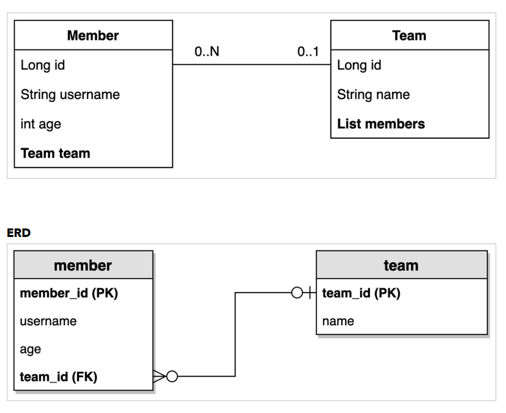

# querydsl_inf

인프런 실전! Querydsl 김영한님 강의 정리 Repo

# 목차

* Querydsl 소개
    * 소개
    * 강의 자료

* 프로젝트 환경설정
    * 프로젝트 생성

    * Querydsl 설정과 검증

    * 라이브러리 살펴보기

    * H2 데이터베이스 설치

    * 스프링 부트 설정 - JPA, DB

* 예제 도메인 모델
    * 예제 도메인 모델과 동작확인

* 기본 문법시작 - JPQL vs Querydsl
    * 기본 Q-Type 활용

    * 검색 조건 쿼리

    * 결과 조회

    * 정렬

    * 페이징

    * 집합

    * 조인 - 기본 조인

    * 조인 - on절

    * 조인 - 페치 조인

    * 서브 쿼리

    * Case 문

    * 상수, 문자 더하기

* 중급 문법

    * 프로젝션과 결과 반환 - 기본

    * 프로젝션과 결과 반환 - DTO 조회

    * 프로젝션과 결과 반환 - @QueryProjection

    * 동적 쿼리 - BooleanBuilder 사용

    * 동적 쿼리 - Where 다중 파라미터 사용

    * 수정, 삭제 벌크 연산

* SQL function 호출하기
    * 실무 활용 - 순수 JPA와 Querydsl
    * 순수 JPA 리포지토리와 Querydsl

    * 동적 쿼리와 성능 최적화 조회 - Builder 사용

    * 동적 쿼리와 성능 최적화 조회 - Where절 파라미터 사용

    * 조회 API 컨트롤러 개발

* 실무 활용 - 스프링 데이터 JPA와 Querydsl
    * 스프링 데이터 JPA 리포지토리로 변경
    * 사용자 정의 리포지토리

    * 스프링 데이터 페이징 활용1 - Querydsl 페이징 연동

    * 스프링 데이터 페이징 활용2 - CountQuery 최적화

    * 스프링 데이터 페이징 활용3 - 컨트롤러 개발

* 스프링 데이터 JPA가 제공하는 Querydsl 기능
    * 인터페이스 지원 - QuerydslPredicateExecutor

    * Querydsl Web 지원

    * 리포지토리 지원 - QuerydslRepositorySupport

    * Querydsl 지원 클래스 직접 만들기

# 프로젝트 생성

* 스프링 부트 스타터(https://start.spring.io/)
    * 사용 기능: Spring Web, jpa, h2, lombok
    * querydsl은 별도로 디펜던시 추가

## IntelliJ Gradle 대신에 자바로 바로 실행하기

* 최근 IntelliJ 버전은 Gradle로 실행을 하는 것이 기본 설정이다. 이렇게 하면 실행속도가 느리다. 다음과 같이 변경하면 자바로 바로 실행하므로 좀 더 빨라진다.

1. 1references Build, Execution, Deployment Build Tools Gradle
2. Build and run using: Gradle IntelliJ IDEA
3. Run tests using: Gradle IntelliJ IDEA

```kotlin
# build.gradle 에 주석을 참고해서 querydsl 설정 추가
plugins {
    id 'org.springframework.boot' version ‘2.2.2.RELEASE'
    id 'io.spring.dependency-management' version '1.0.8.RELEASE'

    //querydsl 추가
    id "com.ewerk.gradle.plugins.querydsl" version "1.0.10"
    id 'java'
}

...

dependencies {
    implementation 'org.springframework.boot:spring-boot-starter-data-jpa'
    implementation 'org.springframework.boot:spring-boot-starter-web'
    //querydsl 추가
    implementation 'com.querydsl:querydsl-jpa'
    //
    compileOnly 'org.projectlombok:lombok'
    runtimeOnly 'com.h2database:h2'
    annotationProcessor 'org.projectlombok:lombok'
    testImplementation('org.springframework.boot:spring-boot-starter-test') {
        exclude group : ‘org.junit.vintage’, module: ‘junit-vintage-engine'
    }
}

//querydsl 추가 시작
def querydslDir = "$buildDir/generated/querydsl"

querydsl {
    jpa = true
    querydslSourcesDir = querydslDir
}

sourceSets {
    main.java.srcDir querydslDir
}

configurations {
    querydsl.extendsFrom compileClasspath
}

compileQuerydsl {
    options.annotationProcessorPath = configurations.querydsl
}
//querydsl 추가 끝
```

## 빌드하여 querydsl용 QType Entity 생성하는법

검증용 Q 타입 생성

* querydsl이 @Entity 를 보고 자동으로 생성해준다.

* Gradle IntelliJ 사용법 (인텔리제이 오른쪽 gradle에서 사용하면 된다. )
    * Gradle Tasks build clean
    * Gradle Tasks other compileQuerydsl

* Gradle 콘솔 사용법
    * ./gradlew clean compileQuerydsl

* Q 타입 생성 확인
    * build -> generated -> querydsl
        * study.querydsl.entity.QHello.java 파일이 생성되어 있어야 함
        * 빌드파일 아래에 같은 패키지명으로 생성되어있따.

> 참고: Q타입은 컴파일 시점에 자동 생성되므로 버전관리(GIT)에 포함하지 않는 것이 좋다. 앞서 설정에서 생성 위치를 gradle build 폴더 아래 생성되도록 했기 때문에 이 부분도 자연스럽게 해결된다. (대부분 gradle build 폴더를 git에 포함하지 않는다.)

* 참고: 스프링 부트에 아무런 설정도 하지 않으면 h2 DB를 메모리 모드로 JVM안에서 실행한다

# 라이브러리 살펴보기

* gradle 의존관계 보기 : ./gradlew dependencies --configuration compileClasspath

### Querydsl 라이브러리 살펴보기

* querydsl-apt: Querydsl 관련 코드 생성 기능 제공
* querydsl-jpa: querydsl 라이브러리

# H2

H2 데이터베이스 설치

* 개발이나 테스트 용도로 가볍고 편리한 DB, 웹 화면 제공
* https://www.h2database.com

다운로드 및 설치

* h2 데이터베이스 버전은 스프링 부트 버전에 맞춘다.
* 권한 주기: chmod 755 h2.sh

데이터베이스 파일 생성 방법

* jdbc:h2:~/querydsl (최소 한번)
    * 연결 성공하면 ~ 경로에 query.mv.db 파일이 생성된다
* ~/querydsl.mv.db 파일 생성 확인
* 이후 부터는 jdbc:h2:tcp://localhost/~/querydsl 이렇게 접속
    * 인텔리제이로 어플리케이션을 실행하고, 따로 접속하면 에러가 나기 때문에 tcp 모드로 접속

> 참고: H2 데이터베이스의 MVCC 옵션은 H2 1.4.198 버전부터 제거되었습니다. 이후 부터는 옵션 없이 사용하면 됩니다.
> 주의: 가급적 안정화 버전을 사용하세요. 1.4.200 버전은 몇가지 오류가 있습니다.
> 현재 안정화 버전은 1.4.199(2019-03-13) 입니다.
> 다운로드 링크: https://www.h2database.com/html/download.html

# 스프링부트 JPA,DB 설정

```yaml

spring:
  datasource:
    url: jdbc:h2:tcp://localhost/~/querydsl
    username: sa
    password:
    driver-class-name: org.h2.Driver

  jpa:
    hibernate:
      ddl-auto: create
    properties:
      hibernate:
      # show_sql: true
      format_sql: true

logging.level:
  org.hibernate.SQL: debug
# org.hibernate.type: trace trace로 설정시 쿼리의 파라미터의 ? 가 보인다 
```

참고: 모든 로그 출력은 가급적 로거를 통해 남겨야 한다.
> show_sql : 옵션은 System.out 에 하이버네이트 실행 SQL을 남긴다.


> org.hibernate.SQL : 옵션은 logger를 통해 하이버네이트 실행 SQL을 남긴다.

## 쿼리 파라미터 로그 남기기

* 로그에 다음을 추가하기 org.hibernate.type : SQL 실행 파라미터를 로그로 남긴다.
* 외부 라이브러리 사용
    * https://github.com/gavlyukovskiy/spring-boot-data-source-decorator
* 스프링 부트를 사용하면 이 라이브러리만 추가하면 된다
    * implementation 'com.github.gavlyukovskiy:p6spy-spring-boot-starter:1.5.8'

> 참고: 쿼리 파라미터를 로그로 남기는 외부 라이브러리는 시스템 자원을 사용하므로, 개발 단계에서는 편하게 사용해도 된다. 하지만 운영시스템에 적용하려면 꼭 성능테스트를 하고 사용하는 것이 좋다.

# 예제 도메인 모델

* 

* 롬복 설명
* @Setter: 실무에서 가급적 Setter는 사용하지 않기
* @NoArgsConstructor AccessLevel.PROTECTED: 기본 생성자 막고 싶은데, JPA 스팩상 PROTECTED로 열어두어야 함
* @ToString은 가급적 내부 필드만(연관관계 없는 필드만)
* changeTeam() 으로 양방향 연관관계 한번에 처리(연관관계 편의 메소드)

# 기본문법

## JPQL vs Querydsl

```java
 @Test
public void startJPQL(){
        // member1을 찾아라
        String qlString="select m from Member m "+
        "where m.username = :username";

        Member findMember=em.createQuery(qlString,Member.class)
        .setParameter("username","member1")
        .getSingleResult();

        assertThat(findMember.getUsername()).isEqualTo("member1");
        }

@Test
public void startQuerydsl(){
        JPAQueryFactory jpaQueryFactory=new JPAQueryFactory(em);

        QMember m=new QMember("m");

        Member findMember=jpaQueryFactory
        .select(m)
        .from(m)
        .where(m.username.eq("member1")) // 파라미터 바인딩 처리
        .fetchOne();

        assertThat(findMember.getUsername()).isEqualTo("member1");

        }
```

* EntityManager 로 JPAQueryFactory 생성
* Querydsl은 JPQL 빌더
* JPQL: 문자(실행 시점 오류), Querydsl: 코드(컴파일 시점 오류)
* JPQL: 파라미터 바인딩 직접, Querydsl: 파라미터 바인딩 자동 처리

* querydsl의 파라미터 바인딩 방식은 preparestatement의 파라미터 바인딩 방식을 사용한다.
    * where(m.username.eq("member1"))

```java

public class QuerydslBasicTest {

    @Autowired
    EntityManager em;

    JPAQueryFactory jpaQueryFactory;


    @BeforeEach
    public void before() {
        jpaQueryFactory = new JPAQueryFactory(em);
    ...
    }
}
```

* JPAQueryFactory를 필드로 제공하면 동시성 문제는 어떻게 될까?

> 동시성 문제는 JPAQueryFactory를 생성할 때 제공하는 EntityManager(em)에 달려있다.  
스프링 프레임워크는 여러 쓰레드에서 동시에 같은 EntityManager에 접근해도,   
> 트랜잭션 마다 별도의 영속성 컨텍스트를 제공하기 때문에, 동시성 문제는 걱정하지 않아도 된다

# 기본 Q- type 활용

```java
QMember qMember=new QMember("m"); //별칭 직접 지정
        QMember qMember=QMember.member; //기본 인스턴스 사용, static 
```

* static import 해서 member만으로도 사용할 수 있다.
* properties에 다음 설정을 추가하면 실행되는 JPQL 볼 수 있다.
    * spring.jpa.properties.hibernate.use_sql_comments: true

> `참고: 같은 테이블을 조인해야 하는 경우가 아니면 기본 인스턴스를 사용하자`

# 검색 조건 쿼리

## 기본 검색 쿼리

```java
jpaQueryFactory
        .select(member)
        .from(member)
        .where(member.username.eq("member1"))
        .fetchOne();
// 아래처럼 select, from을 selectFrom으로 합칠 수 있다. 
        jpaQueryFactory
        .selectFrom(member)
        .where(member.username.eq("member1").and(member.age.eq(10)))
        .fetchOne();
```

* 검색 조건은 .and(), or() 메서드 체인으로 연결할 수 있다.
* select, from을 selectFrom으로 합칠 수 있다

## JPQL이 제공하는 모든 검색 조건 제공한다

```java
member.username.eq("member1"); // username = 'member1'
member.username.ne("member1"); //username != 'member1'
member.username.eq("member1").not(); // username != 'member1'
member.username.isNotNull(); //이름이 is not null
member.age.in(10,20); // age in (10,20)
member.age.notIn(10,20); // age not in (10, 20)
member.age.between(10,30); //between 10, 30
member.age.goe(30); // age >= 30
member.age.gt(30); // age > 30
member.age.loe(30); // age <= 30
member.age.lt(30);// age < 30
member.username.like("member%"); //like 검색
member.username.contains("member"); // like ‘%member%’ 검색
member.username.startsWith("member"); //like ‘member%’ 검색
```

|메서드|해석|뜻|
|---|---|---|
|eq() |(equal) |  =
|ne() |(not equal) | !=
|eq().not() |(not equal) | !=
|isNotNull() | (is not null) | not null
|in() |(in, 포함) | in
|notIn() |(notIn, 미포함) | not in
|between(a, b) |a와 b 사이| between a and b|
|goe(30) |(greater or equal, 크거나 같음) | age >= 30
|gt(30) | greater, 초과, 크다| age > 30|
|loe(30)| little or equal, 작거나 같다 | age <= 30
|lt(30) | little, 미만, 작다 | age < 30
|like() |  | like 검색
|contains("member") | 포함 | like %member%
|startsWith("member")| 으로부터 | like member%

## AND 조건을 파라미터로 처리

```java
List<Member> result1=queryFactory
        .selectFrom(member)
        .where(member.username.eq("member1"),member.age.eq(10))
        .fetch();
```

* 파라미터로 a, b, c 를 넣으면 `a and b and c`

```java
public Q where(Predicate...o){
        return queryMixin.where(o);
        }
 ```

* 이 경우 null 값은 무시 메서드 추출을 활용해서 동적 쿼리를 깔끔하게 만들 수 있음 -> 뒤에서 설명

# 쿼리 결과 조회

* fetch() : 리스트 조회, 데이터 없으면 빈 리스트 반환
* fetchOne() : 단 건 조회
    * 결과가 없으면 : null
    * 결과가 둘 이상이면 : com.querydsl.core.NonUniqueResultException
* fetchFirst() : limit(1).fetchOne()
* fetchResults() : 페이징 정보 포함, total count 쿼리 추가 실행
* fetchCount() : count 쿼리로 변경해서 count 수 조회

```java
//페이징에서 사용
QueryResults<Member> results=queryFactory
        .selectFrom(member)
        .fetchResults();

int count=results.getTotal();
List<Member> content=results.getResults();
```

# 정렬

```java
/**
 * 회원 정렬 순서
 * 1. 회원 나이 내림차순(desc)
 * 2. 회원 이름 올림차순(asc)
 * 단 2에서 회원 이름이 없으면 마지막에 출력(nulls last)
 */
@Test
public void sort(){
        em.persist(new Member(null,100));
        em.persist(new Member("member5",100));
        em.persist(new Member("member6",100));
        List<Member> result=queryFactory
          .selectFrom(member)
          .where(member.age.eq(100))
          .orderBy(member.age.desc(),member.username.asc().nullsLast())
          .fetch();
        
        Member member5=result.get(0);
        Member member6=result.get(1);
        Member memberNull=result.get(2);
        
        assertThat(member5.getUsername()).isEqualTo("member5");
        assertThat(member6.getUsername()).isEqualTo("member6");
        assertThat(memberNull.getUsername()).isNull();
}
```

* desc() , asc() : 일반 정렬
* nullsLast() , nullsFirst() : null 데이터 순서 부여
  * 널 마지막에, 널 처음부터

# querydsl 페이징

## 조회 건수 제한 
```java
@Test
public void paging1() {
    List<Member> result = queryFactory
        .selectFrom(member)
        .orderBy(member.username.desc())
        .offset(1) //0부터 시작(zero index)
        .limit(2) //최대 2건 조회
        .fetch();
assertThat(result.size()).isEqualTo(2);
}
```

* offset(1) : 0부터 시작이다. 1이라는건 1을 스킵

## 전체 조회수
```java
@Test
public void paging2() {
    QueryResults<Member> queryResults = queryFactory
        .selectFrom(member)
        .orderBy(member.username.desc())
        .offset(1)
        .limit(2)
        .fetchResults();
    
    assertThat(queryResults.getTotal()).isEqualTo(4);
    assertThat(queryResults.getLimit()).isEqualTo(2);
    assertThat(queryResults.getOffset()).isEqualTo(1);
    assertThat(queryResults.getResults().size()).isEqualTo(2);
}
```

* 주의: count 쿼리가 실행되니 성능상 주의!
> 참고: 실무에서 페이징 쿼리를 작성할 때, 데이터를 조회하는 쿼리는 여러 테이블을 조인해야 하지만,
count 쿼리는 조인이 필요 없는 경우도 있다.   
> 그런데 이렇게 자동화된 count 쿼리는 원본 쿼리와 같이 모두 조인을 해버리기 때문에 성능이 안나올 수 있다.   
> count 쿼리에 조인이 필요없는 성능 최적화가 필요하다면,
count 전용 쿼리를 별도로 작성해야 한다


# 집합(집계함수)

## 집합함수

```java
/**
* JPQL
* select
* COUNT(m), //회원수
* SUM(m.age), //나이 합
* AVG(m.age), //평균 나이
* MAX(m.age), //최대 나이
* MIN(m.age) //최소 나이
* from Member m
*/
@Test
public void aggregation() throws Exception{
        List<Tuple> result=queryFactory
            .select(member.count(),
                    member.age.sum(),
                    member.age.avg(),
                    member.age.max(),
                    member.age.min())
        .from(member)
        .fetch();
        Tuple tuple=result.get(0);
}
```

## GroupBy 사용

```java
/**
* 팀의 이름과 각 팀의 평균 연령을 구해라.
*/
@Test
public void group() throws Exception {
    List<Tuple> result = queryFactory
        .select(team.name, member.age.avg())
        .from(member)
        .join(member.team, team)
        .groupBy(team.name)
        .fetch();
    Tuple teamA = result.get(0);
    Tuple teamB = result.get(1);
    
    assertThat(teamA.get(team.name)).isEqualTo("teamA");
    assertThat(teamA.get(member.age.avg())).isEqualTo(15);
    assertThat(teamB.get(team.name)).isEqualTo("teamB");
    assertThat(teamB.get(member.age.avg())).isEqualTo(35);
}

```
### groupBy , 그룹화된 결과를 제한하려면 having

```java
…
.groupBy(item.price)
.having(item.price.gt(1000))
…
```

# 조인 - 기본 조인
기본 조인
조인의 기본 문법은 첫 번째 파라미터에 조인 대상을 지정하고, 두 번째 파라미터에 별칭(alias)으로 사용할
Q 타입을 지정하면 된다.

* join(조인 대상, 별칭으로 사용할 Q타입)

```java
/**
* 팀 A에 소속된 모든 회원
*/
@Test
public void join() throws Exception {
    QMember member = QMember.member;
    QTeam team = QTeam.team;
    
    List<Member> result = queryFactory
        .selectFrom(member)
        .join(member.team, team)
        .where(team.name.eq("teamA"))
        .fetch();
    assertThat(result)
        .extracting("username")
        .containsExactly("member1", "member2");
}
```

* join() , innerJoin() : 내부 조인(inner join)
* leftJoin() : left 외부 조인(left outer join)
* rightJoin() : rigth 외부 조인(rigth outer join)
* JPQL의 on 과 성능 최적화를 위한 fetch 조인 제공 다음 on 절에서 설명

# 조인 - 세타조인

* 연관관계가 없는 조인 
```java
    /**
     * 세타 조인
     * 회원의 이름이 팀 이름과 같은 회원 조회
     */
    @Test
    public void theta_join() {
        em.persist(new Member("teamA"));
        em.persist(new Member("teamB"));

        List<Member> result = jpaQueryFactory
                .select(member)
                .from(member, team)
                .where(member.username.eq(team.name))
                .fetch();
        
    }
```
* from 절에 여러 엔티티를 선택해서 세타 조인

# 조인 -on 절

* ON절을 활용한 조인(JPA 2.1부터 지원)
  1. 조인 대상 필터링
  2. 연관관계 없는 엔티티 외부 조인

1. 조인대상 필터링 
```java
/**
     * 예) 회원과 팀을 조인하면서, 팀 이름이 teamA인 팀만 조인, 회원은 모두 조회
     * JPQL: SELECT m, t FROM Member m LEFT JOIN m.team t on t.name = 'teamA'
     * SQL: SELECT m.*, t.* FROM Member m LEFT JOIN Team t ON m.TEAM_ID=t.id and
     t.name='teamA'
     */
    @Test
    public void join_on_filtering() throws Exception {
        List<Tuple> result = jpaQueryFactory
                .select(member, team)
                .from(member)
                .leftJoin(member.team, team).on(team.name.eq("teamA"))
                .fetch();
        for (Tuple tuple : result) {
            System.out.println("tuple = " + tuple);
        }
    }
```

>  참고: on 절을 활용해 조인 대상을 필터링 할 때, 외부조인이 아니라 내부조인(inner join)을 사용하면,  
where 절에서 필터링 하는 것과 기능이 동일하다.  
 따라서 on 절을 활용한 조인 대상 필터링을 사용할 때,  
내부조인 이면 익숙한 where 절로 해결하고, 정말 외부조인이 필요한 경우에만 이 기능을 사용하자

 

2. 연관관계 없는 엔티티 외부 조인 

```java
/**
 * 2. 연관관계 없는 엔티티 외부 조인
 * 예) 회원의 이름과 팀의 이름이 같은 대상 외부 조인
 * JPQL: SELECT m, t FROM Member m LEFT JOIN Team t on m.username = t.name
 * SQL: SELECT m.*, t.* FROM Member m LEFT JOIN Team t ON m.username = t.name
 */
@Test
public void join_on_no_relation() throws Exception {
        em.persist(new Member("teamA"));
        em.persist(new Member("teamB"));
        List<Tuple> result = jpaQueryFactory
                .select(member, team)
                .from(member)
                .leftJoin(team).on(member.username.eq(team.name))
                .fetch();
        for (Tuple tuple : result) {
            System.out.println("t=" + tuple);
        }
}
```

* 하이버네이트 5.1부터 on 을 사용해서 서로 관계가 없는 필드로 외부 조인하는 기능이 추가되었다. 물론
내부 조인도 가능하다.
* 주의! 문법을 잘 봐야 한다. leftJoin() 부분에 일반 조인과 다르게 엔티티 하나만 들어간다.
* 일반조인: leftJoin(member.team, team)
* on조인: from(member).leftJoin(team).on(xxx)

# 조인 - 페치조인
* 페치 조인은 SQL에서 제공하는 기능은 아니다. SQL조인을 활용해서 연관된 엔티티를 SQL 한번에
  조회하는 기능이다. 주로 성능 최적화에 사용하는 방법이다
  * 한쿼리로 다 끌고온다.


## 페치조인 적용 
* 즉시 로딩으로 Member,Team SQL 쿼리 조인으로 한번에 조회 
```java
@PersistenceUnit // EntityManagerFactory를 만들어줌 
EntityManagerFactory emf;

@Test
public void fetchJoinUse() throws Exception {
    em.flush();
    em.clear();
    Member findMember = queryFactory
        .selectFrom(member)
        .join(member.team, team).fetchJoin() // 
        .where(member.username.eq("member1"))
        .fetchOne();

    boolean loaded = emf.getPersistenceUnitUtil().isLoaded(findMember.getTeam());
    assertThat(loaded).as("페치 조인 적용").isTrue();
}
```

사용방법
* join(), leftJoin() 등 조인 기능 뒤에 fetchJoin() 이라고 추가하면 된다.
> 참고: 페치 조인에 대한 자세한 내용은 JPA 기본편이나, 활용2편을 참고하자

# 서브쿼리(서브 쿼리)

* com.querydsl.jpa.JPAExpressions 사용


```java
/**
* 나이가 가장 많은 회원 조회
*/
@Test
public void subQuery() throws Exception {
    QMember memberSub = new QMember("memberSub"); // 서브쿼리 조회용, alias가 같으면 안됨 
    List<Member> result = queryFactory
        .selectFrom(member)
        .where(member.age.eq(JPAExpressions // import
        .select(memberSub.age.max())
            .from(memberSub)
        ))
        .fetch();
    
    assertThat(result).extracting("age")
        .containsExactly(40);
}
```
* member랑 alias가 겹치면 안되므로 QMember를 새로 생성

## 서브쿼리 여러 건 처리 in 사용
* 서브쿼리 in

```java
@Test
public void subQueryIn() throws Exception {
    QMember memberSub = new QMember("memberSub");
    List<Member> result = queryFactory
        .selectFrom(member)
        .where(member.age.in(
                JPAExpressions
                    .select(memberSub.age)
                    .from(memberSub)
                    .where(memberSub.age.gt(10))
        ))
        .fetch();
        
    assertThat(result).extracting("age")
    .containsExactly(20, 30, 40);
}
```

## select 절에서 subquery

```java
QMember memberSub = new QMember("memberSub");
List<Tuple> fetch = queryFactory
    .select(member.username,
            JPAExpressions
                .select(memberSub.age.avg())
                .from(memberSub)
            ).from(member)
    .fetch();

    for (Tuple tuple : fetch) {
        System.out.println("username = " + tuple.get(member.username));
        System.out.println("age = " +
        tuple.get(JPAExpressions.select(memberSub.age.avg())
            .from(memberSub)));
    }
```
* from 절의 서브쿼리 한계
> JPA JPQL 서브쿼리의 한계점으로 from 절의 서브쿼리(인라인 뷰)는 지원하지 않는다. 당연히 Querydsl
도 지원하지 않는다. 하이버네이트 구현체를 사용하면 select 절의 서브쿼리는 지원한다. Querydsl도
하이버네이트 구현체를 사용하면 select 절의 서브쿼리를 지원한다.

* from 절의 서브쿼리 해결방안
1. 서브쿼리를 join으로 변경한다. (가능한 상황도 있고, 불가능한 상황도 있다.)
2. 애플리케이션에서 쿼리를 2번 분리해서 실행한다.
3. nativeSQL을 사용한다

# Case문

* case, when, then

```java
//단순한 조건
List<String> result = queryFactory
        .select(member.age
                .when(10).then("열살")
                .when(20).then("스무살")
                .otherwise("기타"))
        .from(member)
        .fetch();

//복잡한 조건
List<String> result = queryFactory
        .select(new CaseBuilder()
            .when(member.age.between(0, 20)).then("0~20살")
            .when(member.age.between(21, 30)).then("21~30살")
            .otherwise("기타"))
        .from(member)
        .fetch();
```

* orderBy에서 Case 문 함께 사용하기 예제
> 참고: 강의 이후 추가된 내용입니다.  

예를 들어서 다음과 같은 임의의 순서로 회원을 출력하고 싶다면?
1. 0 ~ 30살이 아닌 회원을 가장 먼저 출력
2. 0 ~ 20살 회원 출력
3. 21 ~ 30살 회원 출력

```java
    NumberExpression<Integer> rankPath = new CaseBuilder()
                .when(member.age.between(0, 20)).then(2)
                .when(member.age.between(21, 30)).then(1)
                .otherwise(3);
        
    List<Tuple> result = queryFactory
                .select(member.username, member.age, rankPath)
                .from(member)
                .orderBy(rankPath.desc())
                .fetch();
        
        for (Tuple tuple : result) {
            String username = tuple.get(member.username);
            Integer age = tuple.get(member.age);Integer rank = tuple.get(rankPath);
            System.out.println("username = " + username + " age = " + age + " rank = " + rank);

```

* Querydsl은 자바 코드로 작성하기 때문에 rankPath 처럼 복잡한 조건을 변수로 선언해서 select 절,
  orderBy 절에서 함께 사용할 수 있다

# 상수, 문자 더하기

* 상수가 필요하면 querydsl의 Expressions.constant(xxx) 사용

```java
Tuple result = queryFactory
    .select(member.username, Expressions.constant("A"))
    .from(member)
    .fetchFirst();
```

* 참고: 위와 같이 최적화가 가능하면 SQL에 constant 값을 넘기지 않는다. 상수를 더하는 것 처럼 최적화가
   어려우면 SQL에 constant 값을 넘긴다.

## 문자 더하기

* ex) username + _ + age

```java
String result = queryFactory
    .select(member.username.concat("_").concat(member.age.stringValue()))
    .from(member)
    .where(member.username.eq("member1"))
    .fetchOne();
// 결과 : member1_10
```

* `참고: member.age.stringValue() 부분이 중요한데, 문자가 아닌 다른 타입들은 stringValue() 로
  문자로 변환할 수 있다. 이 방법은 ENUM을 처리할 때도 자주 사용한다.`


